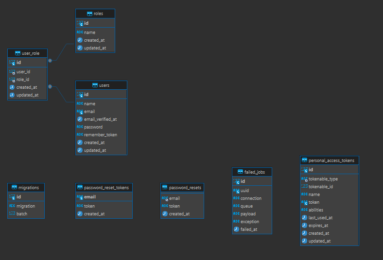
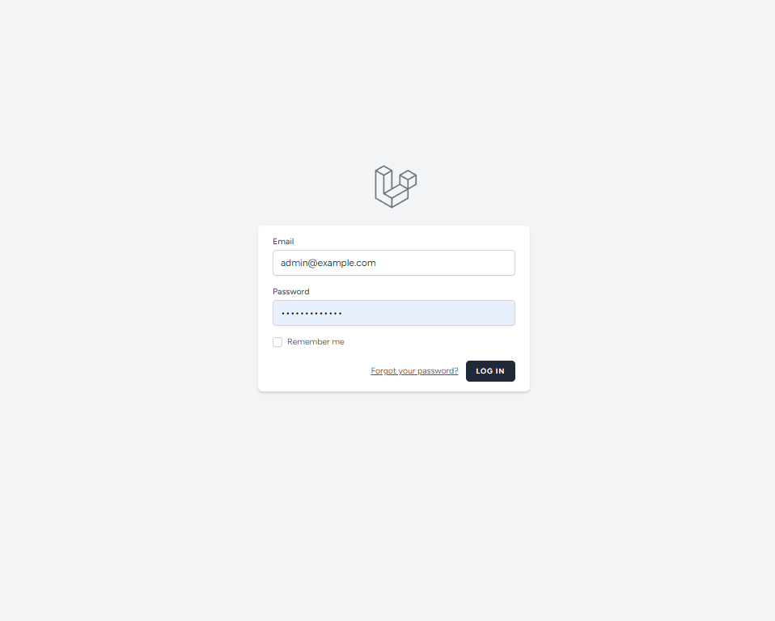
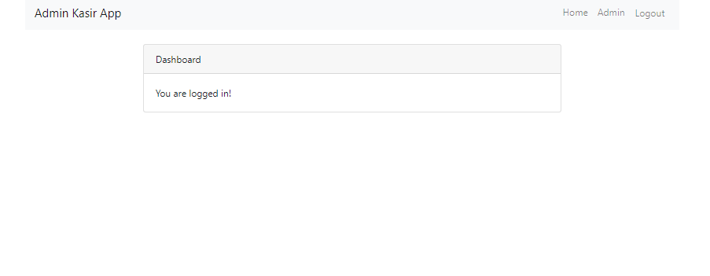
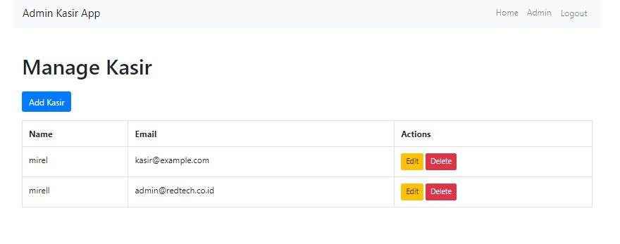
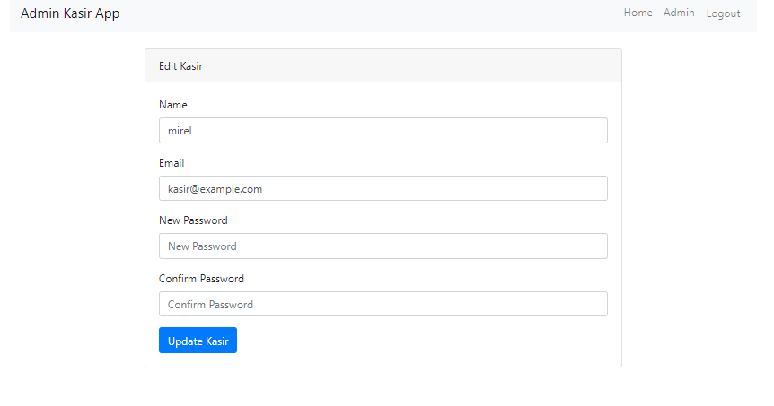
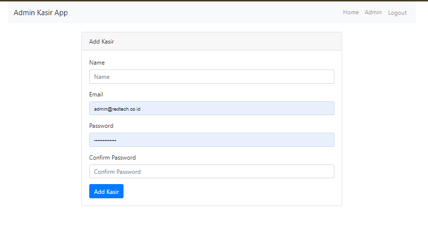
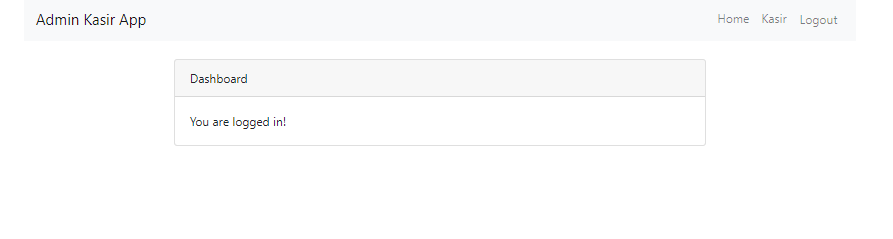
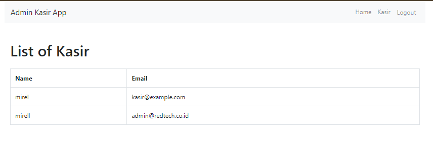

 
# Aplikasi Laravel Admin-Kasir

Ini adalah aplikasi Laravel dengan peran admin dan kasir. Admin dapat mengelola kasir dan memberikan hak akses.

## DAFTAR ISI
1. [Prasyarat](#prasyarat)
2. [peran User](#aplikasi-ini-memiliki-dua-peran-utama) 
3. [proses bisnis](#Alur-proses-bisnis-aplikasi-secara-umum-adalah-sebagai-berikut) 
4. [Mengakses Aplikasi](#mengakses-aplikasi)
5. [Instalasi](#instalasi)
6. [Mengkonfigurasi Lingkungan](#mengkonfigurasi-lingkungan)
7. [Login dan Pengujian](#login-dan-pengujian)
   - [Login sebagai Admin](#login-sebagai-admin)
   - [Login sebagai Kasir](#login-sebagai-kasir)
8. [ERD Database](#erd-database)
9. [Database Schema](#database-schema)
   - [Tabel `users`](#tabel-users)
   - [Tabel `roles`](#tabel-roles)
   - [Tabel `user_role`](#tabel-user_role)
   - [Tabel `migrations`](#tabel-migrations)
   - [Tabel `password_reset_tokens`](#tabel-password_reset_tokens)
   - [Tabel `password_resets`](#tabel-password_resets)
   - [Tabel `failed_jobs`](#tabel-failed_jobs)
   - [Tabel `personal_access_tokens`](#tabel-personal_access_tokens)
9. [Tampilan Aplikasi](#tampilan-aplikasi)
   - [Login](#login)
   - [ADMIN](#admin)
   - [KASIR](#kasir)


## Prasyarat

- PHP
- laravel
- CSS
- HTML
- Js
- Komposer
- Node.js dan npm
- Database server (for example, MySQL)

## aplikasi ini memiliki dua peran utama
```bash
1. Admin:
   - Admin dapat mengelola kasir dan memberikan hak akses.
   - Admin dapat melakukan CRUD (Create, Read, Update, Delete) terhadap data kasir.
   - Admin dapat mengatur dan mengawasi kinerja kasir.

2. Kasir:
   - Kasir dapat melakukan transaksi penjualan.
   - Kasir dapat melihat riwayat transaksi yang telah dilakukan.
   - Kasir tidak dapat mengubah data dirinya atau data kasir lainnya.
```


## Alur proses bisnis aplikasi secara umum adalah sebagai berikut
``` bash
1. Admin mengelola data kasir, termasuk menambah, mengubah, atau menghapus data kasir.
2. Admin dapat memberikan hak akses kepada kasir sehingga kasir dapat melakukan transaksi penjualan.
3. Kasir dapat melakukan transaksi penjualan sesuai dengan hak akses yang diberikan oleh admin.
4. Kasir dapat melihat riwayat transaksi yang telah dilakukan.
5. Admin dapat mengawasi dan memantau kinerja kasir melalui data transaksi yang tercatat.
```


## Mengakses Aplikasi
```bash
http://127.0.0.1:8000
```
# Login dan Pengujian

## Login sebagai Admin
```bash
Email: admin@example.com
password: password
```
## Login sebagai Kasir
```bash
Email: kasir@example.com
password: password
```


## Instalasi

- Mengkloning Proyek

``` bash
git clone <repository-url>
cd <project-folder>
```
- Menginstal Ketergantungan
```bash
composer install
npm install
```
- Perbarui berkas .env dengan konfigurasi basis data Anda
```bash
DB_CONNECTION = mysql
DB_HOST = 127.0.0.1
DB_PORT=3306
DB_DATABASE = admin
DB_USERNAME = root
DB_PASSWORD = 
```
## Mengkonfigurasi Lingkungan
- Salin berkas .env.example ke .env:

``` bash
cp .env.example .env
```
- Menjalankan Server Laravel
```bash
php artisan migrate --seed
php artisan serve
```
- Menghasilkan Kunci Aplikasi
``` bash
php generate key:generate
```

# Menyiapkan Otentikasi
- Menginstal Laravel UI:
``` bash
composer require laravel/ui
```

- Buat perancah untuk autentikasi:
```bash
php artisan ui vue --auth
npm install && npm run dev
php artisan serve
```

# ERD Database


# Database Schema

Diagram ini menggambarkan skema basis data yang terdiri dari beberapa tabel dengan relasi antar tabel. Berikut adalah penjelasan masing-masing tabel dan kolom yang ada.

## Tabel `users`
Tabel ini menyimpan informasi pengguna.
- **id**: Integer, primary key, auto-increment.
- **name**: String, nama pengguna.
- **email**: String, alamat email pengguna.
- **email_verified_at**: Timestamp, waktu verifikasi email.
- **password**: String, kata sandi pengguna.
- **remember_token**: String, token untuk remember me.
- **created_at**: Timestamp, waktu pembuatan data.
- **updated_at**: Timestamp, waktu update terakhir.

## Tabel `roles`
Tabel ini menyimpan informasi peran pengguna.
- **id**: Integer, primary key, auto-increment.
- **name**: String, nama peran.
- **created_at**: Timestamp, waktu pembuatan data.
- **updated_at**: Timestamp, waktu update terakhir.

## Tabel `user_role`
Tabel ini menghubungkan pengguna dengan peran mereka.
- **id**: Integer, primary key, auto-increment.
- **user_id**: Integer, foreign key ke tabel `users`.
- **role_id**: Integer, foreign key ke tabel `roles`.
- **created_at**: Timestamp, waktu pembuatan data.
- **updated_at**: Timestamp, waktu update terakhir.

## Tabel `migrations`
Tabel ini menyimpan informasi migrasi basis data.
- **id**: Integer, primary key, auto-increment.
- **migration**: String, nama migrasi.
- **batch**: Integer, nomor batch migrasi.

## Tabel `password_reset_tokens`
Tabel ini menyimpan token reset password.
- **email**: String, alamat email pengguna.
- **token**: String, token reset password.
- **created_at**: Timestamp, waktu pembuatan token.

## Tabel `password_resets`
Tabel ini menyimpan reset password.
- **email**: String, alamat email pengguna.
- **token**: String, token reset password.
- **created_at**: Timestamp, waktu pembuatan token.

## Tabel `failed_jobs`
Tabel ini menyimpan informasi pekerjaan yang gagal.
- **id**: Integer, primary key, auto-increment.
- **uuid**: String, UUID pekerjaan.
- **connection**: String, koneksi yang digunakan.
- **queue**: String, antrian pekerjaan.
- **payload**: Text, payload pekerjaan.
- **exception**: Text, pengecualian yang terjadi.
- **failed_at**: Timestamp, waktu kegagalan pekerjaan.

## Tabel `personal_access_tokens`
Tabel ini menyimpan token akses personal.
- **id**: Integer, primary key, auto-increment.
- **tokenable_type**: String, tipe entitas yang dapat di-token.
- **tokenable_id**: Integer, ID entitas yang dapat di-token.
- **name**: String, nama token.
- **token**: String, token akses.
- **abilities**: Text, kemampuan token.
- **last_used_at**: Timestamp, waktu terakhir penggunaan.
- **expires_at**: Timestamp, waktu kedaluwarsa token.
- **created_at**: Timestamp, waktu pembuatan token.
- **updated_at**: Timestamp, waktu update terakhir.


# tampilan aplikasi
## login


## ADMIN






## KASIR



