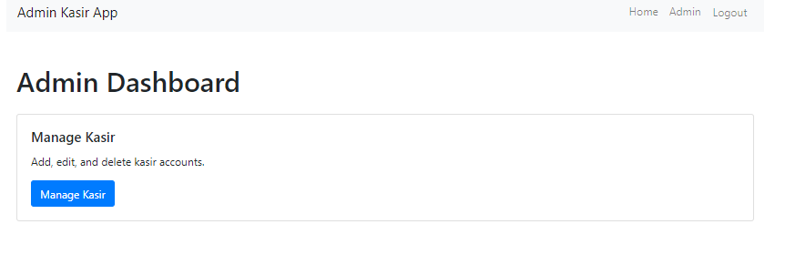

 
# Aplikasi Laravel Admin-Kasir

Ini adalah aplikasi Laravel dengan peran admin dan kasir. Admin dapat mengelola kasir dan memberikan hak akses.

## Prasyarat

- PHP
- Komposer
- Node.js dan npm
- Database server (for example, MySQL)


# Mengakses Aplikasi
```bash
http://127.0.0.1:8000
```
# Login dan Pengujian

## Login sebagai Admin
```bash
Email: admin@example.com
password: password
```
## Login sebagai Kasir
```bash
Email: kasir@example.com
password: password
```


## Instalasi

### Mengkloning Proyek

``` bash
git clone <repository-url>
cd <project-folder>
```
# Menginstal Ketergantungan
```bash
composer install
npm install
```
## Perbarui berkas .env dengan konfigurasi basis data Anda
```bash
DB_CONNECTION = mysql
DB_HOST = 127.0.0.1
DB_PORT=3306
DB_DATABASE = basis data Anda
DB_USERNAME = nama_pengguna Anda
DB_PASSWORD = kata sandi Anda
```
# Mengkonfigurasi Lingkungan
## Salin berkas .env.example ke .env:

``` bash
cp .env.example .env
```
# Menjalankan Server Laravel
```bash
php artisan migrate --seed
php artisan serve
```
# Menghasilkan Kunci Aplikasi
``` bash
php generate key:generate
```

# Menyiapkan Otentikasi
## Menginstal Laravel UI:
``` bash
composer require laravel/ui
```

## Buat perancah untuk autentikasi:
```bash
php artisan ui vue --auth
npm install && npm run dev
php artisan migrasi
```

# ERD Database


# tampilan aplikasi
## login


## ADMIN




## KASIR


